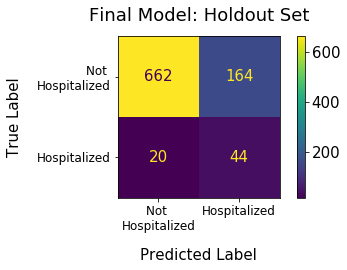

# Preventing Hospitalizations with Machine Learning

Author: Lili Beit

  Photo by <a href="https://unsplash.com/@swimstaralex?utm_source=unsplash&utm_medium=referral&utm_content=creditCopyText">Alexander Sinn</a> on <a href="https://unsplash.com/s/photos/machine-learning?utm_source=unsplash&utm_medium=referral&utm_content=creditCopyText">Unsplash</a>

## Overview

Over the past two decades, the U.S. health care community has taken significant strides in the direction of [value-based care](https://catalyst.nejm.org/doi/full/10.1056/CAT.17.0558).  The federal government and private insurers have started to incentivize providers to deliver high-quality care at low cost, rather than on a fee-for-service basis.  Networks of providers and hospitals that coordinate care are able to improve health outcomes and reduce health care costs.  Under value-based payment systems such as [Medicare's Accountable Care Organization (ACO) program](https://innovation.cms.gov/innovation-models/aco), provider networks that reduce costs are entitled to a share of the savings to the insurer.

## Business Problem

One of the greatest benefits of coordinated care is a reduction in hospitalizations due to better management of chronic diseases. Successfully preventing adverse events helps patients stay healthy, reduces the costs to society of unexpected illness, and creates savings for insurers and ACOs.

Thus, a major goal for ACOs is to identify patients who are at high risk for hospitalization and target them for outreach. By keeping these patients out of the hospital, the ACO can realize its goal of reducing costs to the insurer and keep a share of the savings.

This project uses machine learning to predict which patients are likely to be hospitalized over the next twelve months.  Using the data in their electronic health records (EHR) and billing systems, ACOs can replicate this model to target patients for care management and reduce hospitalizations.

## Data Understanding

To test models for predicting hospitalizations, I used data from the [2017-2018 National Health and Nutrition Examination Survey (NHANES)](https://wwwn.cdc.gov/nchs/nhanes/continuousnhanes/default.aspx?BeginYear=2017).  This survey, which is sponsored by the Centers for Disease Control, examined a nationally representative sample of over 9,000 people located in counties across the U.S.  NHANES employs a rigorous process to gather demographic, health history, physical examination, and laboratory data from each participant.  For this project I used only a few of the hundreds of variables NHANES makes publicly available.  I excluded participants younger than 2 from this analysis, because the predictors I focused on were not available for these participants.

Only 8.5% of NHANES participants were hospitalized, reflecting a large class imbalance between hospitalized and non-hospitalized patients, as shown below.

The data cleaning and feature engineering steps I followed can be found in [this notebook](https://github.com/lilisbeit/nhanes/blob/main/data-cleaning-and-feature-engineering.ipynb).

## Modeling

### Model Types and Metrics

Before modeling, I set aside 10% of the data in a holdout set, and used it to evaluate the final model.  

I tested several model types including logistic regression, naive Bayes, random forest, and gradient-boosted tree.  I evaluated each model on its recall (sensitivity) score, while ensuring that the precision (specificity) score was not too low.  Since ACOs will need a list of specific patients to target, the goal of this project was to correctly identify as many hospitalized patients as possible, with a lesser focus on excluding patients who were not hospitalized.  I set a minimum threshold of 0.2 for precision, meaning that the ratio of false positive to true positives cannot exceed 4:1.  

I also calculated the Receiver Operating Curve (ROC-AUC) score for reference, because an [AJMC article](https://www.ajmc.com/view/predicting-hospitalizations-from-electronic-health-record-data) on using data to predict hospitalizations used this metric to evaluate models.  The study authors used EHR and billing data to predict which patients would be hospitalized over the next 6 months, and built a model with an ROC-AUC score of 0.846.

All scores were calculated by running five-fold cross-validation and taking the mean of each metric.

### Baseline Model

The baseline model is a logistic regression with a **recall score of 0.02, a precision score of 0.45, and a ROC-AUC score of 0.51**.  Although precision is high, recall is too low to be useful to an ACO.  They would have very few patients on their list to target for outreach.

### Final Model

The final model is a logistic regression with a **recall score of 0.69, a precision score of 0.21 and an ROC-AUC score of 0.74**, when tested on a hold-out set.  This model narrowly beat out a random forest model which had a higher recall of 0.70, but a lower precision of 0.18, below the threshold of 0.2.  The final model included the following features:

* circulatory conditions
* respiratory conditions
* diabetes
* arthritis
* liver conditions
* cancer
* age
* race
* total number of prescription drugs

Final model predictions on the holdout set are below:

## Conclusions
Identifying hospitalized NHANES participants was a challenging problem since they comprise just 8.5% of all participants, and because some hospitalizations are due to random accidents rather than prior medical conditions. The final model provides value to ACOs by correctly predicting 69% of hospitalized patients, while keeping false positives (people whom the model predicted would be hospitalized but were not) to less than 80% of all predicted positives.

The model's precision score was 0.21, meaning that 21 out of every hundred participants returned by the model were truly hospitalized.  The model's 69% recall rate means that most hospitalized participants would be captured by the model. Since each avoided hospitalization is a step toward savings for ACOs, ACOs seek to identify as many high-risk patients as possible.

The final model improved on the baseline model, which identified only 2% of hospitalized participants, though about 45% of the participants it flagged were truly hospitalized.

## Further Investigation
Although the Logistic Regression model was selected as the final model, the Random Forest had a better recall score.  Its precision score did not quite meet the 0.2 threshold, but if it had, the Random Forest would have been the best performing model.  It is possible that with better hyperparameter tuning, or with more data, a Random Forest would perform better. 

It also seemed that the affect of age buckets rather than a continuous age variable was helpful to the Naive Bayes model but perhaps detrimental to the Logistic Regression and Random Forest models.  A next step would be to test these models with an altered DataFrame containing a continuous age column.
